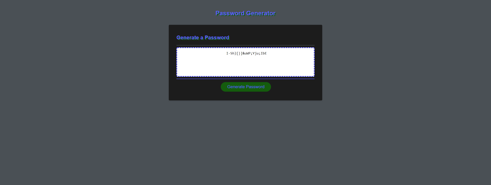

# <password_generator>
## Description
Provide a short description explaining the what, why, and how of your project. Use the following questions as a guide:
- What was your motivation? With there being so many different websites that require individual passwords I wanted to build a password generator that could take in the requirements of the website and give me strong passwords. 
- Why did you build this project? I build this password generator to make easy of use with different website password requirements simple and easy. 
- What problem does it solve? My password generator will save you time when having to create a new password! This generator is simplistic and easy to utilize.  
- What did you learn? When working on this project I was able to add multiple skillsets to my tool box. Specifically this project helped me focus on my script.js capabilities.  
## Installation
Attached is a link to the deployed page for easy access. https://addonelson.github.io/password_generator/
## Usage

To utilize the password generator upon the screen loading it will prompt for a password length
1. Enter a number between 8-->128 and press OK
2. If you would like UPPERCASE letters in your password, press OK on the next prompt window. If you do not want UPPERCASE letters in your password simply press the CANCEL button.
3. If you would like lowercase letters in your password, press OK on the next prompt window. If you do not want lowercase letters in your password simply press the CANCEL button.
4. If you would like numnbers in your password, press OK on the next prompt window. If you do not want numbers in your password simply press the CANCEL button.
5. If you would like special characters in your password, press OK on the next prompt window. If you do not want special characters in your password simply press the CANCEL button.
6. After answering all the above prompt questions your password will generate in the text box. Simply copy this new random password to your deisred website. Enjoy!
## Credits
I want to give a special shout out to Nicole Pingar for her support in creating this webpage. 
## Badges

